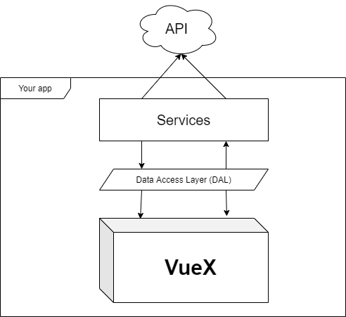

## About

🦊 Preset for Vue application. With with a **ready-made architecture**

[NPM plugin](https://www.npmjs.com/package/vue-cli-plugin-kami)

## Install

For usage copy and paste it in your directory console

`vue add vue-cli-plugin-kami`

## Architecture

Application architecture



### Directory Structure

Generator has created these files:

```js
src
├── helper
│   └── mixins
│       ├── dialog.js             👈 Mixin for dialog components
│       └── main.js               👈 File with all mixins!
├── middleware
│   ├── WebClient.js              👈 Axios config
│   └── services                  👈 All app services
│       └── ExampleService.js
├── router
│   ├── index.js
│   ├── initListners.js           👈 Inject all listners in router instance
│   ├── routes
│   └── listners
│       ├── beforeEach.js         👈 Hook before page started load
│       ├── beforeResolve.js      👈 Hook after all router hook has been resolved
│       └── index.js
└── store
    ├── index.js
    ├── VuexModule.js             👈 Сlass that describes all Vuex modules
    └── modules
        ├── example.js
        └── index.js
```
